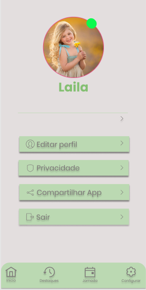
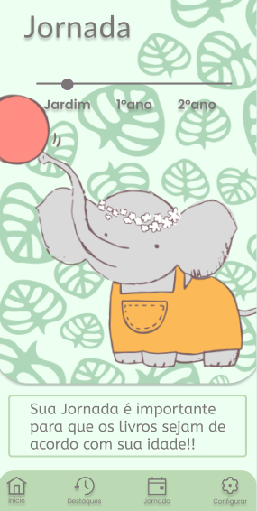
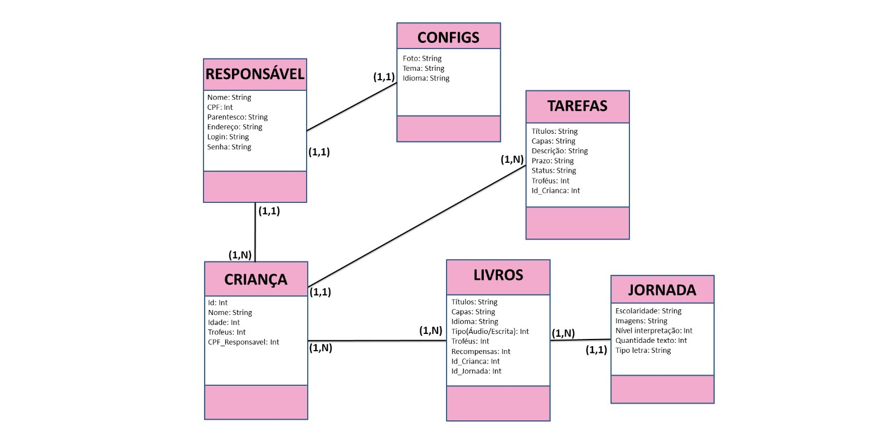

# Net Wids

# Sobre o projeto

Este trabalho visa apresentar a prototipação de um software de agenda infantil através de
cronograma de tarefas e suas recompensas. A plataforma oferece opções de criação de
tarefas e gerenciamento das mesmas e leitura.

## Layout mobile
 

 

## Modelo conceitual

# Tecnologias utilizadas

As ferramentas utilizadas desde o planejar ao desenvolver do projeto foram diversas. A seguir serão citadas a maioria delas de forma objetiva. Jira, Visual Studio Code, Microsoft Word, Power Point, Excel, Sql Workbench, Figma, GitHub, Metrô Retrô, Planning Poker.

# Como funciona o sistema:

+ **Cadastro:** Ao clicar em cadastro será direcionado a um formulário no final da 
página, e ao submete-lo o envio, será realizada a conferencia dos dados e 
apresentação dos termos de uso.
+ **Login:** Ao clicar será redirecionado a página de login do sistema em uma outra 
aba (Se estiver o fazendo pela primeira vez o sistema cria automaticamente um 
usuário e senha “admin”,” admin” respectivamente). Os campos para 
preenchimento são intuitivos e descritos.

## **Dentro do sistema:** As funções de cada menu serão descritas abaixo.
1) **Criação Tarefa:** O responsável pode fazê-lo ao selecionar a 
opção “Tarefas” na página de menu e em seguida o símbolo “+”.
Será direcionado a página de criação dos cartões de tarefa, onde 
se estabelece a tarefa, uma capa, descrição, quantidade de 
troféus, prazo e recompensa.

2)  **Seleção Tarefa:** Página direcionada a visualização dos cartões 
de tarefas disponíveis de acordo com a criação do responsável, 
para que sejam escolhidas e selecionadas. O acesso é através 
da seleção da opção “Tarefas” na página de menu

3) **Status Tarefa:** Existem campos a serem preenchidos (seleção 
do ícone de status), após completa-los será gerada realizada a 
contagem de troféus comparada a expectativa. O acesso é 
através da seleção do cartão de determinada tarefa, é possível 
checar a situação da tarefa, seu prazo e quantidade de troféus.

4) **Atualização:** Há um campo de busca no qual o usuário deve 
digitar o nome da tarefa ou livro, para que o mesmo seja 
encontrado e alterado posteriormente na tabela que aparece no 
caso das tarefas.

+ **Troféus:** A página não possui campos a serem preenchidos, o acesso é 
através da seleção da opção “Troféus” na página de menu. Nesta página 
acontece a consulta da quantidade total de troféus em comparação a 
quantidade de troféus necessária para determinado tipo de recompensa.

+ **Jornada:** Página em que é selecionada a escolaridade da criança 
através de um ícone em uma barra que pode ser arrastado aos 
indicadores do Jardim ao 2°ano, para que os livros indicados sejam de 
acordo. Quantidade de ilustrações, necessidade de interpretação, texto, 
tipo de letra.

+ **Destaques/Amigos:** A página na qual o podem ser encontrados amigos 
e vistos os destaques postados pelos mesmos. O responsável pode os 
gerenciar (adicionar e/ou excluí-los).

+ **Livros:** A página de cartões de livros, após escolher o livro e o tipo de 
leitura, (escrita ou ouvida) são apresentadas as histórias.

+ **Configurações:** Nessa página se encontram as opções de temas 
(cores), idiomas e a opção de sair da plataforma.

+ **Sair:** Clicando nessa opção a sessão é encerrada e se retorna a página 
de login.

# Autores

*FELIPE RAFAEL - 059402*  
*GABRIEL MICHELAN - 059009*  
*IZAUIR GUILHERME - 175353*  
*JOYCE BARROS - 059339*
