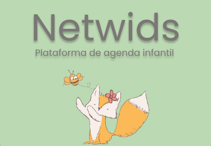
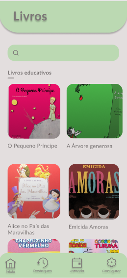

# Net Wids


[](https://github.com/devsuperior/sds1-wmazoni/blob/master/LICENSE) 

# Sobre o projeto

Este trabalho visa apresentar a prototipação de um software de agenda infantil através de
cronograma de tarefas e suas recompensas. A plataforma oferece opções de criação de
tarefas e gerenciamento das mesmas e leitura.

## Layout mobile
 

 

## Modelo conceitual


# Tecnologias utilizadas
## Linguagem
- Python
## Ferramentas
- Figma (construção do layout)

# Como executar o projeto

Pré-requisitos: Java 11

```bash
# clonar repositório
git clone https://github.com/devsuperior/sds1-wmazoni

# entrar na pasta do projeto back end
cd backend

# executar o projeto
./mvnw spring-boot:run
```

# Autor
